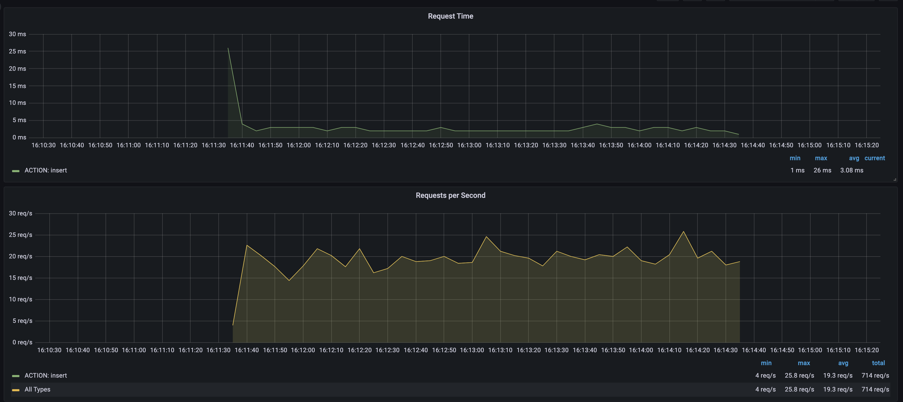

# PRJCTR HSA HOMEWORK 9

This project contains solution for 9th prjctr hometask. 
It includes mariadb container, simple python web app written with fastapi,
TIG stack for monitoring resources during tests. The main goal is to test 
the database operation with 40m+ randomly generated users table. Tests include
selecting operations performance without index and with btree and hash indexes, 
also inserting in the same configurations and with different flush log settings. 
Results are available below.

## Prerequisites

[Docker](https://www.docker.com/products/docker-desktop/) installation.

[siege](https://linux.die.net/man/1/siege) installation for running tests.

## Setup and running

* Check `./app` folder for a web server.
* Check `./conf.d` folder for a mariadb configuration. The same config was 
used across different tests, only `innodb_flush_log_at_trx_commit` variable
was changed during insert tests.
* Check `./initdb.d` folder for the entrypoint SQLs.
* Check `./siege_urls.txt` for the `siege` test URLs.

To run the app:

1. `docker-compose build`
2. `docker-compose up -d`
3. (optional) Check `./app/settings.py` to configure the tests and web app.
4. (optional) Run the seeds: `docker-compose run app python seed.py`
5. Run tests: `siege -c100 -d1 -i -q -t180s --file=./siege_urls.txt --log=siege.log`.
This command was used for almost all the tests and it runs multiple requests 
with 100 connections for 180 seconds.

## Results

Users table definition

Users count

### No index

Without index, I had a very fast insert operations which almost 
aren't depend on log trx commit setting. And a very poor time for selecting
operations. Moreover, queries like `WHERE birth_date > ?` or 
`WHERE birth_date < ?` were often timed out.

#### Reading

Web stats

System stats

MySQL stats

MySQL queries stats

MySQL buffer stats

#### Inserts (`innodb_flush_log_at_trx_commit = 0`)

Web stats

System stats

MySQL log writes stats

#### Inserts (`innodb_flush_log_at_trx_commit = 1`)

MySQL log writes stats

#### Inserts (`innodb_flush_log_at_trx_commit = 2`)

Web stats

System stats

MySQL stats

MySQL buffer stats

MySQL log writes stats

### Btree index

Indexes were significantly changed the reading operations time. But 
insert speed was reduced in comparison with no index. Also, the 
creating index operation is a very expensive one.

Index creation

#### Reading

Web stats

System stats

Even I had swap usage percentage :)

MySQL stats

MySQL queries

MySQL buffer 

#### Inserts (`innodb_flush_log_at_trx_commit = 0`)

Web stats

System stats

MySQL buffer stats

MySQL log writes stats

#### Inserts (`innodb_flush_log_at_trx_commit = 1`)

Web stats

MySQL buffer stats

MySQL log writes stats

#### Inserts (`innodb_flush_log_at_trx_commit = 2`)

Web stats

MySQL buffer stats

MySQL buffer pages stats

MySQL log writes stats

### Hash index

To enable hash index in mariadb >=10.6 a special configuration setting needs to be added.

`innodb_adaptive_hash_index = 0`

Index creation

#### Reading

Web stats

System stats

MySQL stats

MySQL queries

MySQL buffer stats

MySQL buffer requests stats

#### Inserts (`innodb_flush_log_at_trx_commit = 0`)

Web stats

System stats

MySQL buffer stats

MySQL log writes stats

#### Inserts (`innodb_flush_log_at_trx_commit = 1`)

Web stats

System stats

MySQL buffer stats

MySQL log writes stats

#### Inserts (`innodb_flush_log_at_trx_commit = 2`)

Web stats

System stats

MySQL buffer stats

MySQL log writes stats

---

More images with stats during different setups can be found in `./images` folder.
